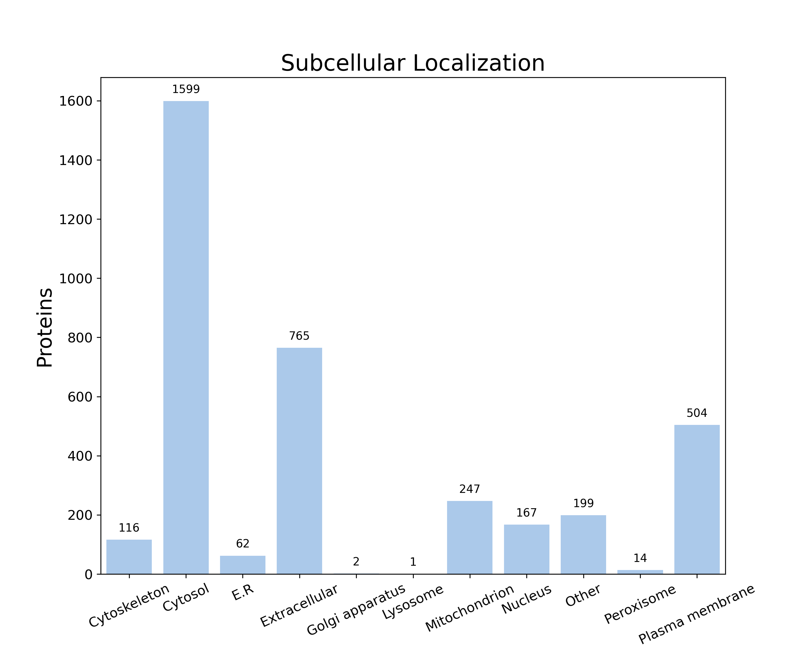
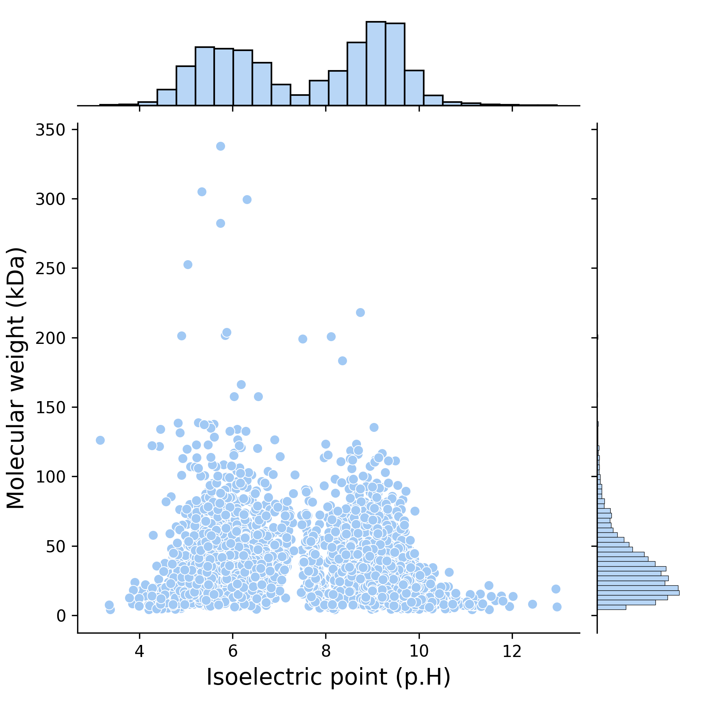

# RELATÓRIO DE ESTUDO DE CASO: ANÁLISE PROTEÔMICA E EPÍTOPOS DA BACTÉRIA *Leptospira interrogans*

**IDENTIFICAÇÃO DA EQUIPE**

* **Integrantes:** Guilherme Guzzo
* **Data:** 02/10/2026

---

## 1. CARACTERIZAÇÃO DO ORGANISMO PATOGÊNICO

* **Descrição morfológica:** Espiroqueta. Bactéria helicoidal, fina e flexível, com
  aproximadamente 0,1–0,15 µm de diâmetro por 6–20 µm de comprimento. Suas extremidades
  são encurvadas em gancho e lembram um sinal de interrogação — origem do epíteto
  específico *interrogans*. A motilidade é dada por dois flagelos periplasmáticos
  (endoflagelos), um em cada polo, internos ao envelope celular, que produzem o
  deslocamento em saca-rolhas característico do gênero; observam-se movimentos
  translacionais e não translacionais.

* **Classificação de Gram:** **Gram-negativa.** Possui envelope diderme, com membrana
  externa contendo lipopolissacarídeo (LPS) e proteínas de superfície. Na prática, cora
  mal pelo método de Gram: o diâmetro de ~0,1 µm está próximo do limite de resolução da
  microscopia óptica convencional e a composição da membrana externa retém pouco corante.
  Por isso a visualização é feita por microscopia de campo escuro, impregnação por prata
  (método de Levaditi) ou imunofluorescência. Vale registrar uma particularidade dos
  espiroquetas: a camada de peptidoglicano associa-se à membrana citoplasmática, e não ao
  espaço periplasmático como nas gram-negativas clássicas.

* **Patologia:** **Leptospirose.** Zoonose de distribuição mundial, com cerca de 1 milhão
  de casos e aproximadamente 60 mil óbitos por ano segundo o CDC. A transmissão ocorre
  por contato com água ou solo contaminados pela urina de animais infectados — roedores
  são o principal reservatório e eliminam a bactéria de forma assintomática, além de
  bovinos, suínos, equinos, ovinos, caprinos, cães e gatos. A entrada se dá por pele
  lesada ou por mucosas. O período de incubação vai de 2 a 30 dias. O curso é bifásico:
  a fase anictérica, responsável por cerca de 90% dos casos, cursa com febre, calafrios,
  cefaleia intensa, mialgia (marcadamente em panturrilhas), náusea, vômito e diarreia; a
  forma grave, conhecida como **doença de Weil**, evolui com icterícia, insuficiência
  renal aguda, fenômenos hemorrágicos, meningite e síndrome de hemorragia pulmonar, com
  letalidade elevada. O tratamento de escolha é doxiciclina ou penicilina. No Brasil é
  agravo de notificação compulsória, com surtos classicamente associados a enchentes.

* **Curiosidade:** *L. interrogans* não utiliza glicose como fonte principal de carbono e
  não realiza glicólise funcional. Seu carbono e sua energia vêm da **β-oxidação de
  ácidos graxos de cadeia longa insaturados**, e é justamente por isso que o meio de
  cultura EMJH precisa ser suplementado com Tween e soro — uma bactéria patogênica que,
  bioquimicamente, "come gordura" em vez de açúcar. É aeróbia obrigatória e depende de
  fosforilação oxidativa. Dois outros pontos chamam atenção: os mais de 300 sorovares da
  espécie são definidos pelas diferenças no antígeno O do LPS, e a chaperona HtpG é fator
  de virulência essencial — mutantes *htpG* são completamente avirulentos, com 100% de
  sobrevivência em hamsters mesmo sob doses altas do inóculo.

* **Cepa analisada:** **56601**, sorovar Lai, sorogrupo Icterohaemorrhagiae. Cepa
  altamente virulenta isolada na China e a primeira *Leptospira* a ter o genoma completo
  sequenciado (Ren *et al.*, 2003). Taxon ID NCBI: 189518.

* **Imagem em microscópio da bactéria:**
  Micrografia eletrônica de varredura (MEV) de duas células de *Leptospira interrogans*
  (cepa RGA) aderidas a um filtro de 0,2 µm. A cepa RGA foi isolada em 1915 do sangue de
  um soldado belga.
  *Fonte: CDC Public Health Image Library, imagem ID 1220 — domínio público.
  Crédito: CDC/Rob Weyant, PhD, MS; foto de Janice Haney Carr.*

---

## 2. DADOS DO PROTEOMA (UNIPROT)

* **ID do Proteoma de Referência:** UP000001408
* **Espécie/Linhagem:** *Leptospira interrogans* serogroup Icterohaemorrhagiae serovar Lai
  (strain 56601) — Taxon ID 189518
* **Total de proteínas no proteoma:** **3.676** (387 revisadas em Swiss-Prot e 3.289 não
  revisadas em TrEMBL)
* **Total de cromossomos:** **2**, ambos circulares
  * Cromossomo I — GenomeAccession **AE010300** — 3.384 proteínas (~4,3 Mb)
  * Cromossomo II — GenomeAccession **AE010301** — 292 proteínas (~350 kb)
* **Classificação:** Reference proteome. Completude BUSCO de 100% (239/239 genes
  completos, linhagem Spirochaetia).
* **Lista de publicações associadas:**
  1. Ren S.-X., Fu G., Jiang X.-G., Zeng R., Miao Y.-G., Xu H., Zhang Y.-X., Xiong H.,
     Lu G., Lu L.-F., Jiang H.-Q., Jia J., Tu Y.-F., Jiang J.-X., Gu W.-Y., Zhang Y.-Q.,
     Cai Z., Sheng H.-H., Yin H.-F., Zhang Y., Zhu G.-F., Wan M., Huang H.-L., Qian Z.,
     Wang S.-Y., Ma W., Yao Z.-J., Shen Y., Qiang B.-Q., Xia Q.-C., Guo X.-K., Danchin A.,
     Saint Girons I., Somerville R.L., Wen Y.-M., Shi M.-H., Chen Z., Xu J.-G., Zhao G.-P.
     **"Unique physiological and pathogenic features of *Leptospira interrogans* revealed
     by whole-genome sequencing."** *Nature*, 2003; 422:888–893.
     PubMed: 12712204 — DOI: 10.1038/nature01597

  *Observação: o registro do proteoma UP000001408 no UniProt lista uma única publicação
  associada, o artigo do genoma completo acima.*

---

## 3. AMBIENTE DE EXECUÇÃO (HARDWARE)

As duas etapas foram executadas em máquinas diferentes. O FastProtein rodou em um
notebook corporativo; o EpiBuilder foi executado em uma segunda máquina porque a
primeira, com 8 GB de RAM, não sustentava o BePiPred-3.0 junto com as demais
aplicações em uso.

**Máquina A — FastProtein**

* **CPU:** 13th Gen Intel® Core™ i5-1334U — 10 núcleos, 12 processadores lógicos,
  clock base 1,30 GHz
* **Memória RAM:** 8 GB DDR5-5600 (7,7 GB utilizáveis)
* **Armazenamento:** SSD NVMe Samsung BM9C1, 512 GB (477 GB formatados) —
  `MediaType: SSD`, `BusType: NVMe`
* **Sistema Operacional:** Windows 11 Home Single Language, versão 10.0.26200
  (build 26200), 64 bits
* **Containers:** Docker Desktop 4.93.0, engine 29.8.1 (linux/amd64)

**Máquina B — EpiBuilder**

* **Modelo:** Acer Nitro ANV15-52
* **CPU:** 13th Gen Intel® Core™ i7-13620H — 10 núcleos, 16 processadores lógicos,
  clock base 2,40 GHz
* **Memória RAM:** 31,7 GB — 2 × 16 GB DDR4-3200 (Kingston)
* **Armazenamento:** SSD NVMe WD PC SN740 SDDQNQD-512G-1014, 512 GB
  (477 GB formatados) — `MediaType: SSD`, `BusType: NVMe`
* **Sistema Operacional:** Windows 11 Home, versão 10.0.26200 (build 26200), 64 bits
* **Containers:** Docker Desktop 4.93.0, engine 29.8.1 (linux/amd64)

As especificações foram coletadas automaticamente pelo próprio script de execução
(`run_analysis.ps1`, etapa 0) e estão preservadas em `logs/hardware_windows.txt`
(Máquina A) e `logs_pc2/hardware_windows.txt` (Máquina B).

---

## 4. RESULTADOS: FASTPROTEIN

Execução na **Máquina A** sobre o proteoma completo (`input.fasta`, 3.676
sequências baixadas do UniProt), com a imagem `bioinfoufsc/fastprotein:clean-latest`.

* **Tempo total de processamento:** **00:06:19** (6M18.838S)
  * início: Fri Oct 02 16:09:12 UTC 2026
  * término: Fri Oct 02 16:15:31 UTC 2026
  * tempo de comandos externos: 6M0.936S — tempo interno do FastProtein: 17,902S
* **Total de proteínas processadas:** **3.676**
* **Total de proteínas ignoradas:** **0** (nenhuma sequência continha caracteres
  não correspondentes a aminoácidos)
* **Proteínas com domínio transmembranar:** **908**
* **Proteínas com evidências de membrana:** **939**

> **Nota sobre a predição de domínios transmembranares:** o FastProtein executa
> dois preditores de TM — TMHMM-2.0c e Phobius. Nesta execução o TMHMM-2.0c
> encerrou em 0,2 s e gravou um arquivo de saída vazio
> (`results_fastprotein/raw/tmhmm2.txt`, 0 bytes), de modo que a coluna `TMHMM_2`
> do `output.tsv` ficou negativa para todas as 3.676 proteínas. As 908 proteínas
> com domínio transmembranar vêm, portanto, integralmente do Phobius
> (coluna `Phobius_TM`), que rodou normalmente em 1M59,85S. O mesmo comportamento
> aparece no exemplo de execução fornecido pelo professor, o que sugere que o
> TMHMM-2.0c não acompanha a imagem `clean-latest` — provavelmente por restrição
> de licença. O valor de 908 é o que o software reporta como `total_tm` e é o que
> está respondido acima; o registro desta nota serve para deixar explícito de qual
> preditor ele veio.

Resultados complementares do mesmo processamento:

| Métrica | Valor |
| :---- | :---- |
| Proteínas com peptídeo sinal (SignalP-5) | 701 |
| Proteínas com âncora GPI (PredGPI) | 13 |
| Proteínas com sítios de N-glicosilação | 2.710 |
| Proteínas com domínios de retenção no R.E. | 512 |
| Massa molecular média | 35,77 ± 25,77 kDa |
| Ponto isoelétrico médio | 7,58 ± 1,77 |
| Hidropatia média | −0,20 ± 0,37 |
| Aromaticidade média | 0,10 ± 0,04 |

### 4.1. Gráficos Gerados

**Localização subcelular** (`results_fastprotein/image/subcell-resume-bar.png`)



| Localização | Proteínas |
| :---- | ----: |
| Citosol | 1.599 |
| Extracelular | 765 |
| Membrana plasmática | 504 |
| Mitocôndria | 247 |
| Outros | 199 |
| Núcleo | 167 |
| Citoesqueleto | 116 |
| Retículo endoplasmático | 62 |
| Peroxissomo | 14 |
| Complexo de Golgi | 2 |
| Lisossomo | 1 |

> **Observação metodológica:** a predição de localização subcelular do FastProtein
> é feita pelo WoLFPSORT, que roda aqui com o modelo de organismo *animal*. Por
> isso aparecem compartimentos que não existem em bactérias — núcleo, mitocôndria,
> complexo de Golgi, lisossomo. Para *L. interrogans*, que é procarioto, essas
> categorias devem ser lidas como agrupamentos por composição de aminoácidos, e
> não como compartimentos reais. As classes biologicamente informativas no caso
> são **membrana plasmática (504)** e **extracelular (765)**, coerentes com as
> 939 proteínas que acumulam evidências de membrana.

**Dispersão: ponto isoelétrico × massa molecular**
(`results_fastprotein/image/kda-vs-pi.png`)



A distribuição do pI é nitidamente bimodal, com um grupo ácido em torno de pH 5–6
e outro básico em torno de pH 9, e um vale perto do pH 7,4. Esse padrão de "dupla
corcova" é comum em proteomas bacterianos e reflete a separação entre proteínas
citoplasmáticas, que tendem ao lado ácido, e proteínas de membrana e ribossomais,
que tendem ao básico. A massa molecular concentra-se abaixo de 50 kDa, com poucas
proteínas passando de 150 kDa.

---

## 5. RESULTADOS: EPIBUILDER

Execução sobre o `top50.fasta` — as 50 primeiras proteínas de membrana preditas
pelo FastProtein — com a imagem `bioinfoufsc/epibuilder-core` e o parâmetro
`--loc gram_neg`, apropriado para *Leptospira interrogans* por ser gram-negativa.

Nenhuma das 50 sequências foi rejeitada na validação (`proteins_invalid.fasta`
ficou vazio). Tempo total da execução: **8 min 14 s**, distribuídos entre
validação do FASTA (0,5 s), predição de localização por PSORTb (1 min 37 s),
BePiPred-3.0 (8 min 11 s), montagem dos epítopos (2 s) e exportação (0,8 s).

* **Nº de proteínas (das 50) com epítopos preditos:** **7**

Foram preditos **8 epítopos** no total, porque a proteína Q8F937 contribuiu com
dois. As sete proteínas:

\begingroup\footnotesize

| Proteína | Descrição (UniProt) | Localização (PSORTb) | Epítopos |
| :---- | :---- | :---- | ----: |
| Q8F937 | Glycine dehydrogenase (decarboxylating) | Cytoplasmic | 2 |
| Q8EZN3 | ATP-dependent zinc metalloprotease FtsH | CytoplasmicMembrane | 1 |
| P59247 | Glycerol-3-phosphate acyltransferase | CytoplasmicMembrane | 1 |
| Q8EXW3 | Adenylate/guanylate cyclase | Cytoplasmic | 1 |
| Q8F145 | Phosphatidate cytidylyltransferase | CytoplasmicMembrane | 1 |
| Q8F2Z5 | Phosphatidylserine decarboxylase proenzyme | CytoplasmicMembrane | 1 |
| Q8EYY4 | Apolipoprotein N-acyltransferase 2 | CytoplasmicMembrane | 1 |

\endgroup


O rendimento de 7 em 50 é baixo, e isso é coerente com o material de entrada: são
proteínas de membrana, cujas alças expostas ao meio externo — as regiões com
potencial antigênico — representam uma fração pequena da cadeia. O restante fica
embebido na bicamada ou voltado para o citoplasma, e o BePiPred-3.0 não atribui a
essas regiões escore suficiente para passar do limiar de 0,15.

### 5.1. Tabela dos 5 Primeiros Epítopos Preditos

\begingroup\footnotesize

| #  | ID Proteína | Descrição (abreviada)     | Epítopo (Sequência)  | Início-Fim | N-glicosilado?         |
|:---|:------------|:--------------------------|:---------------------|:-----------|:-----------------------|
| 1  | Q8F937      | Glycine dehydrogenase     | `TLDKTDNPLKN`        | 892–903    | Não                    |
| 2  | Q8EZN3      | Zinc metalloprotease FtsH | `EEGTKKKPEKTVKSKKQN` | 624–642    | Não                    |
| 3  | P59247      | Glycerol-3-P acyltransf.  | `GEEQDGDSERNR`       | 203–215    | Não                    |
| 4  | Q8EXW3      | Adenylate/guanyl. cyclase | `KEKKPPIPPFRDKTFND`  | 402–419    | Não                    |
| 5  | Q8F937      | Glycine dehydrogenase     | `NSTLQNQTKTN`        | 1–12       | **Sim** — NST (1–3) e NQT (6–8) |

\endgroup


*As descrições estão abreviadas para caber na tabela; os nomes completos de cada
proteína estão na tabela da seção 5 acima.*

Dos oito epítopos preditos, apenas o de número 5 apresenta sítios de
N-glicosilação. Vale observar que o intervalo relatado pelo software abrange
sempre uma posição a mais que o comprimento informado do epítopo — o epítopo 1
tem 11 aminoácidos e é reportado como 892–903, que são 12 posições. O mesmo
deslocamento aparece em todos os registros, o que indica que a coluna `End` é
tratada como limite exclusivo pelo EpiBuilder. Os valores foram transcritos acima
exatamente como o software os emitiu.

### 5.2. Topologia do Epítopo #1

```
Epitopo #1    Q8F937    Cytoplasmic
Posicao 892-903   11 aa   1.26 kDa   pI 5.63   Hidropatia media -1.56

          Metodo  Limiar   Media  Cobert.   T L D K T D N P L K N
----------------  ------  ------  -------   ---------------------
    BepiPred-3.0    0.15    0.18        -   
           Emini    1.00    2.37     1.00   E E E E E E E E E E E
        Kolaskar    1.03    0.96     0.00   . . . . . . . . . . .
     Chou Fosman    0.97    1.21     1.00   E E E E E E E E E E E
  Karplus Schulz    0.99    1.07     1.00   E E E E E E E E E E E
          Parker    1.26    4.01     1.00   E E E E E E E E E E E
     All matches       -       -     0.00   . . . . . . . . . . .
          N-Glyc       -       -     0.00   . . . . . . . . . . .
      Hydropathy       -   -1.56        -   - + - - - - - - + - -

E = residuo predito como epitopo pelo metodo    . = nao predito
Hidropatia:  + = hidrofobico    - = hidrofilico
```

A leitura é a seguinte: cada linha é um método de predição, com seu limiar, o
escore médio obtido e a cobertura, seguidos do mapa resíduo a resíduo ao longo do
epítopo. Quatro dos cinco métodos clássicos — Emini, Chou-Fasman, Karplus-Schulz
e Parker — marcam todos os 11 resíduos como antigênicos, com cobertura 1,00. O
Kolaskar é o único divergente, com cobertura 0,00: ele pontua antigenicidade com
base em hidrofobicidade e acessibilidade, e esse epítopo é fortemente hidrofílico
(hidropatia média −1,56), o que o penaliza nessa escala. A linha `All matches`
fica em 0,00 justamente porque exige concordância de todos os métodos, incluindo
o Kolaskar. A linha `N-Glyc` confirma a ausência de sítios de N-glicosilação neste
epítopo, e a linha `Hydropathy` mostra apenas dois resíduos hidrofóbicos (as
leucinas nas posições 2 e 9), sendo todo o restante hidrofílico — perfil típico de
alça exposta ao solvente.

---

## 6. REPOSITÓRIO

Qual o repositório git: **https://github.com/Guilfs1/bioinformatica-leptospira**

* [x] `relatorio.pdf` — este documento
* [x] `input.fasta` — proteoma completo UP000001408 (3.676 sequências)
* [x] `top50.fasta` — 50 primeiras proteínas de membrana
* [x] `results_fastprotein/` — saída completa, incluindo os dois gráficos
* [x] `results_epibuilder/` — saída completa, incluindo topologia e planilha
