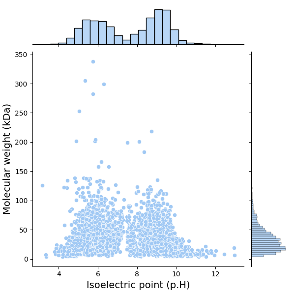
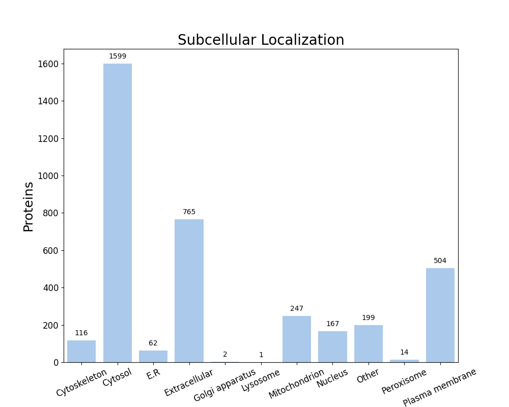

FastProtein Software 1.0
========================
##### Protein Information Software

---
### Summary
| Information                          | Value              |
| ------------------------------------ | ------------------ |
| Processed proteins                   | 3676               |
| Molecular mass (kda) mean            | 35.77 &#177; 25.77 |
| Isoelectric point mean               | 7.58 &#177; 1.77   |
| Hydrophicity mean                    | -0.20 &#177; 0.37  |
| Aromaticity mean                     | 0.10 &#177; 0.04   |
| Proteins with TM                     | 908                |
| Proteins with SP                     | 701                |
| Proteins with GPI                    | 13                 |
| Membrane proteins                    | 939                |
| Proteins with E.R Retention domains  | 512                |
| Proteins with NGlycosylation domains | 2710               |
### Molecular mass (kDa) vs Isoelectric point (pH)

---
### Subcellular localization (by WolfPSort) - Organism: animal

| Subcellular localization | Proteins |
| ------------------------ | -------- |
| Cytosol                  | 1599     |
| Extracellular            | 765      |
| Plasma membrane          | 504      |
| Mitochondrion            | 247      |
| Other                    | 199      |
| Nucleus                  | 167      |
| Cytoskeleton             | 116      |
| E.R                      | 62       |
| Peroxisome               | 14       |
| Golgi apparatus          | 2        |
| Lysosome                 | 1        |
---
### E.R Retention domain summary
| Domain | Quantity |
| ------ | -------- |
| KEEL   | 105      |
| KDEL   | 28       |
| AEEL   | 57       |
| KNEL   | 29       |
| ANEL   | 28       |
| REEL   | 37       |
| QEEL   | 33       |
| KQEL   | 22       |
| SDEL   | 22       |
| SEEL   | 67       |
Only top 10

---
### NGlyc domain summary
| Domain | Quantity |
| ------ | -------- |
| NAS    | 242      |
| NLS    | 605      |
| NLT    | 348      |
| NIS    | 324      |
| NVS    | 384      |
| NFS    | 331      |
| NGS    | 262      |
| NDS    | 234      |
| NST    | 267      |
| NSS    | 408      |
Only top 10

---
| Id     | Length |  kDa   | Isoelectric_Point | Hydropathy | Aromaticity |  Localization   | TMHMM_2 | Phobius_TM | PredGPI | Membrane_evidences | Membrane_evidences_detail |  SignalP5   | Phobius_SP | ER_Retention_Total | NGlyc_Total |           ER_Retention_Domains            |                        NGlyc_Domains                         |                                Header                                 | Local_alignment_description | Gene_Ontology | Interpro_Annotation | PFAM_Annotation | Panther_Annotation |
| ------ |:------:|:------:|:-----------------:|:----------:|:-----------:|:---------------:|:-------:|:----------:|:-------:|:------------------:|:-------------------------:|:-----------:|:----------:|:------------------:|:-----------:|:-----------------------------------------:|:------------------------------------------------------------:|:---------------------------------------------------------------------:| --------------------------- | ------------- | ------------------- | --------------- | ------------------ |
| O34094 |  272   | 29.61  |       6.34        |   -0.26    |    0.08     |  Extracellular  |    0    |     0      |    -    |         0          |                           | SP(Sec/SPI) |     Y      |         0          |      1      |                                           |                          NET[43-46]                          |                Major outer membrane lipoprotein LipL32                | -                           |               |                     |                 |                    |
| Q8EYG9 |  477   | 54.41  |       9.07        |   -0.37    |    0.12     |     Cytosol     |    0    |     0      |    -    |         0          |                           |      -      |     Y      |         0          |      3      |                                           |            NQS[394-397];NKS[453-456];NKT[468-471]            |             4-hydroxybenzoate brominase (decarboxylating)             | -                           |               |                     |                 |                    |
| Q8F3Q1 |  516   | 57.32  |       5.98        |   -0.28    |    0.06     |     Cytosol     |    0    |     0      |    -    |         0          |                           |      -      |     -      |         0          |      2      |                                           |                   NKT[86-89];NKS[474-477]                    |                     (R)-citramalate synthase CimA                     | -                           |               |                     |                 |                    |
| Q8EYV8 |  385   | 41.44  |       6.26        |    0.00    |    0.06     |  Cytoskeleton   |    0    |     0      |    -    |         0          |                           |      -      |     -      |         0          |      1      |                                           |                         NNT[347-350]                         |            Arginine biosynthesis bifunctional protein ArgJ            | -                           |               |                     |                 |                    |
| Q8EZN3 |  655   | 72.54  |       8.60        |   -0.24    |    0.07     | Plasma membrane |    0    |     2      |    -    |         2          |    PHOBIUS_TM&#124;SL     | SP(Sec/SPI) |     -      |         3          |      3      | KEEL[188-192];QEEL[409-413];HDEL[612-616] |            NVS[112-115];NYS[542-545];NAS[593-596]            |                ATP-dependent zinc metalloprotease FtsH                | -                           |               |                     |                 |                    |
| Q8EZP1 |  498   | 56.72  |       6.48        |    0.34    |    0.12     | Plasma membrane |    0    |     7      |    -    |         2          |    PHOBIUS_TM&#124;SL     |      -      |     -      |         0          |      2      |                                           |                  NFS[365-368];NET[385-388]                   |                  Polyamine aminopropyltransferase 1                   | -                           |               |                     |                 |                    |
| Q8F0E1 |  347   | 39.33  |       8.10        |   -0.26    |    0.09     |     Cytosol     |    0    |     0      |    -    |         0          |                           |      -      |     -      |         0          |      1      |                                           |                         NDS[329-332]                         |                 tRNA-dihydrouridine(20/20a) synthase                  | -                           |               |                     |                 |                    |
| Q8F2Z5 |  741   | 83.23  |       9.65        |    0.47    |    0.15     | Plasma membrane |    0    |     12     |    -    |         2          |    PHOBIUS_TM&#124;SL     |      -      |     -      |         0          |      0      |                                           |                                                              |              Phosphatidylserine decarboxylase proenzyme               | -                           |               |                     |                 |                    |
| Q8F3J3 |  538   | 60.52  |       6.62        |   -0.30    |    0.08     |  Mitochondrion  |    0    |     0      |    -    |         0          |                           |      -      |     Y      |         0          |      2      |                                           |                  NFS[275-278];NST[404-407]                   |                             CTP synthase                              | -                           |               |                     |                 |                    |
| Q8F445 |  501   | 54.74  |       5.69        |   -0.24    |    0.06     |     Cytosol     |    0    |     0      |    -    |         0          |                           |      -      |     -      |         0          |      0      |                                           |                                                              |                     2-isopropylmalate synthase 1                      | -                           |               |                     |                 |                    |
| Q8F4I0 |  366   | 40.12  |       5.94        |   -0.20    |    0.10     |     Cytosol     |    0    |     0      |    -    |         0          |                           |      -      |     -      |         0          |      3      |                                           |               NET[1-4];NGS[23-26];NAT[297-300]               |                    Homoserine O-acetyltransferase                     | -                           |               |                     |                 |                    |
| Q8F4J4 |  504   | 56.06  |       6.01        |   -0.19    |    0.08     |     Cytosol     |    0    |     0      |    -    |         0          |                           |      -      |     -      |         1          |      3      |               AEEL[410-414]               |             NSS[83-86];NLT[211-214];NGS[253-256]             | UDP-N-acetylmuramoyl-L-alanyl-D-glutamate--2,6-diaminopimelate ligase | -                           |               |                     |                 |                    |
| Q8F6R2 |  362   | 40.13  |       6.41        |   -0.30    |    0.11     |  Cytoskeleton   |    0    |     0      |    -    |         0          |                           |      -      |     -      |         0          |      4      |                                           |        NGT[8-11];NTS[30-33];NGS[122-125];NDS[342-345]        |               Carbamoyl phosphate synthase small chain                | -                           |               |                     |                 |                    |
| Q8F701 |  401   | 44.36  |       5.69        |   -0.19    |    0.05     |     Cytosol     |    0    |     0      |    -    |         0          |                           |      -      |     -      |         0          |      0      |                                           |                                                              |                 Riboflavin biosynthesis protein RibBA                 | -                           |               |                     |                 |                    |
| Q8F7H3 |  106   | 12.01  |       5.11        |   -0.37    |    0.10     |     Cytosol     |    0    |     0      |    -    |         0          |                           |      -      |     -      |         0          |      1      |                                           |                           NVT[5-8]                           |              Pyrimidine/purine nucleoside phosphorylase               | -                           |               |                     |                 |                    |
| Q8F7H8 |  612   | 70.40  |       8.04        |   -0.30    |    0.10     |     Cytosol     |    0    |     0      |    -    |         0          |                           |      -      |     -      |         2          |      3      |        RDEL[387-391];QEEL[427-431]        |            NVS[104-107];NSS[141-144];NET[265-268]            |                      RecBCD enzyme subunit RecD                       | -                           |               |                     |                 |                    |
| Q8F7H9 |  1046  | 122.76 |       5.47        |   -0.46    |    0.12     |     Nucleus     |    0    |     0      |    -    |         0          |                           |      -      |     -      |         1          |      5      |               KEEL[283-287]               | NVS[1-4];NET[168-171];NLS[619-622];NQS[662-665];NFS[777-780] |                      RecBCD enzyme subunit RecB                       | -                           |               |                     |                 |                    |
| Q8F7V1 |  353   | 39.84  |       8.70        |   -0.24    |    0.09     |     Cytosol     |    0    |     0      |    -    |         0          |                           |      -      |     -      |         0          |      1      |                                           |                          NQT[8-11]                           |         Probable dual-specificity RNA methyltransferase RlmN          | -                           |               |                     |                 |                    |
| Q8F832 |  1106  | 122.85 |       5.22        |   -0.17    |    0.07     |  Extracellular  |    0    |     0      |    -    |         0          |                           |      -      |     -      |         0          |      0      |                                           |                                                              |               Carbamoyl phosphate synthase large chain                | -                           |               |                     |                 |                    |
| Q8F8T4 |  428   | 47.72  |       5.54        |   -0.22    |    0.08     |  Cytoskeleton   |    0    |     0      |    -    |         0          |                           |      -      |     -      |         0          |      4      |                                           |       NES[8-11];NFS[296-299];NQS[369-372];NIT[386-389]       |                     2-isopropylmalate synthase 2                      | -                           |               |                     |                 |                    |
| Q8F9D9 |  486   | 54.30  |       5.55        |   -0.37    |    0.08     |     Cytosol     |    0    |     0      |    -    |         0          |                           |      -      |     -      |         0          |      3      |                                           |            NVS[200-203];NKT[259-262];NIT[362-365]            |      Aspartyl/glutamyl-tRNA(Asn/Gln) amidotransferase subunit B       | -                           |               |                     |                 |                    |
| Q9XD15 |  187   | 20.59  |       6.41        |   -0.31    |    0.04     |     Cytosol     |    0    |     0      |    -    |         0          |                           |      -      |     -      |         0          |      1      |                                           |                          NQT[41-44]                          |                           Adenylate kinase                            | -                           |               |                     |                 |                    |
| D4YW51 |  125   | 13.92  |       5.36        |   -0.01    |    0.10     |     Cytosol     |    0    |     0      |    -    |         0          |                           |      -      |     -      |         0          |      1      |                                           |                         NVS[100-103]                         |             S-adenosylmethionine decarboxylase proenzyme              | -                           |               |                     |                 |                    |
| G1UB27 |  186   | 21.51  |       5.67        |   -0.33    |    0.15     |     Cytosol     |    0    |     0      |    -    |         0          |                           |      -      |     -      |         0          |      1      |                                           |                          NHS[47-50]                          |                 dTDP-4-dehydrorhamnose 3,5-epimerase                  | -                           |               |                     |                 |                    |
| O51941 |  283   | 31.27  |       8.71        |   -0.29    |    0.06     |     Cytosol     |    0    |     0      |    -    |         0          |                           |      -      |     -      |         0          |      1      |                                           |                           NLS[5-8]                           |                Flagellar filament 35 kDa core protein                 | -                           |               |                     |                 |                    |
| P0C0A0 |  128   | 14.22  |       5.36        |    0.01    |    0.10     |     Cytosol     |    0    |     0      |    -    |         0          |                           |      -      |     -      |         0          |      1      |                                           |                         NVS[103-106]                         |             S-adenosylmethionine decarboxylase proenzyme              | -                           |               |                     |                 |                    |
##### Only top 10 proteins

---

##### Do you have a question or tips? Please contact us! E-mail: renato.simoes@ifsc.edu.br
Generated time: Fri Oct 02 16:15:28 UTC 2026